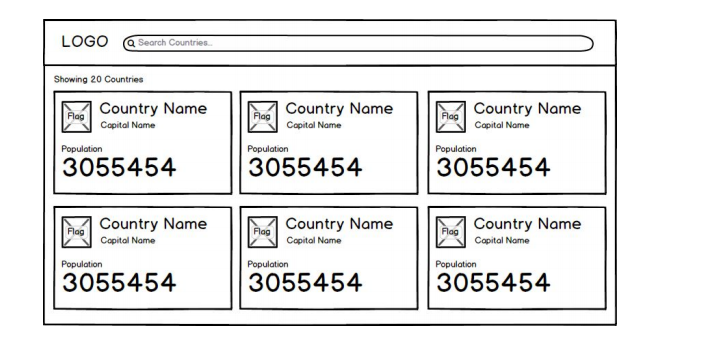

#FrontEnd Countries Data  
 
**Note This application I written with Hooks , Redux and Without Redux for your reference**

****Requirement****:
1) Nodejs

***Installing Dependencies Locally***

``cmd npm i`` - to installing the node dependencies,

**Run Applications Locally**

``cmd npm start`` - to run app locally

**ProtoType**

**Front End Development Application View**

